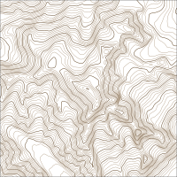
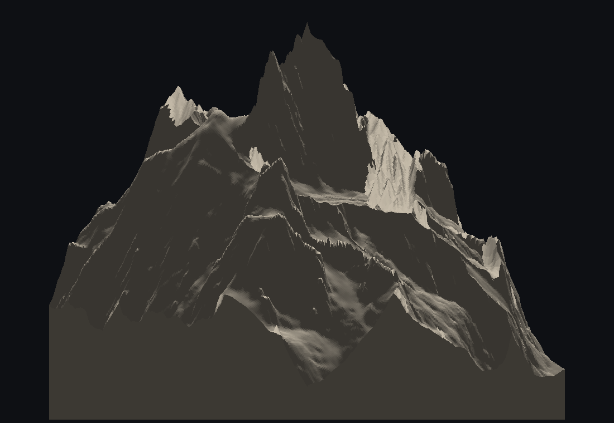

# topofab

Contour maps for a pen plotter, and terrain models for a 3D printer, from real
elevation data. Pick an area on a map, and get either a layered SVG sized in
real millimetres, or a watertight mesh with the water flat and the buildings
standing up.

Runs entirely on your own machine. Nothing is uploaded, and no bulk datasets are
downloaded — elevation and map data are fetched on demand for the area you
selected and cached on disk, a few MB per map.

| SVG for plotting | 3D mesh |
|---|---|
|  |  |

*The same 8 km capture of Mont Blanc, both ways. Regenerate these with
`.venv/bin/python docs/make_samples.py`.*

> [!WARNING]
> **This is AI-generated code and it has not been reviewed by a human.** It was
> written by Claude, working from a running conversation; treat
> anything it tells you about terrain as unverified. It fetches from public
> endpoints and writes files under its own directory; it has no authentication
> and is meant to be run locally, on `127.0.0.1`, by one person.

## Installing

Needs Python 3.12 and [uv](https://docs.astral.sh/uv/). First time:

```bash
uv venv --python 3.12 .venv
uv pip install --python .venv/bin/python fastapi "uvicorn[standard]" httpx numpy contourpy shapely pyproj pillow tifffile imagecodecs osmium
```

Then, every time:

```bash
./run.sh
```

and open <http://127.0.0.1:8724>. `PORT=9000 ./run.sh` to move it.

## Using it

Three panes: **controls**, **map**, **preview**. The **C / M / P** buttons in the
left rail show and hide each (or ⌥1 / ⌥2 / ⌥3), and the dividers drag to resize —
double-click one to collapse the pane beside it. Sizes and visibility persist,
which matters when the browser is already giving up horizontal space to a
sidebar.

The panel runs top to bottom in the order you work: everything above the
**Generate** button describes *what you are capturing* and applies to both
outputs; everything below it is specific to the output you chose, and is tinted
to say so.

### Region

Search for a place, or drag the square on the map. Its handles resize from the
opposite corner; hold **⌥ Option** to resize about the centre. **Fit region to
map view** snaps it to what you are looking at.

**Aspect** locks the shape to a paper or frame ratio, and **Rotation** turns the
capture without turning the output — useful for lining a valley up with the
page. Everything downstream works in an un-rotated "page frame" measured in
ground metres, so a rotated capture is not a special case anywhere else.

### Elevation

**Source** is normally *Auto*, which takes the best data covering the area and
fills any gaps from the next best — a capture crossing a border gets
high-resolution data on both sides.

**Sampling** is the distance between elevation samples. The box under it
measures what is actually available here and offers it as a button. It reads the
real tile listings rather than a coverage map, so it will not promise you LiDAR
that was never flown: at Croabh Haven one tile clips 13% of the frame and
contributes nothing, and the honest answer there is 30 m.

Going finer than the source changes the drawing but adds no information — see
[How fine is worth sampling](docs/how-it-works.md#how-fine-is-worth-sampling)
for the measurements. **Clamp** restricts the output to an elevation band, and
applies to both outputs.

### Smoothing

Contour-line settings only; the mesh reads the elevation grid directly. **Terrain
blur** is the one that matters — it smooths the data before contouring, removing
stair-stepping where the noise actually is. **Simplify** and **Curve** tidy the
finished lines, and **Drop under** discards the confetti of tiny rings that
noisy summits produce.

### OSM data

Roads, paths, water, buildings and the rest come either from **Overpass**, the
public OpenStreetMap query service, or from a **local extract** you download
once and then query instantly and offline. The default uses an extract where one
covers the area and Overpass everywhere else.

Downloading is deliberately a conscious act: extracts are hundreds of megabytes.
The fold-out lists what you have installed and offers what would cover the area,
smallest first. An extract clipped to one area can be **extended** to reach
another without starting over, and re-clipping is free if you kept the source
file.

### Features

Which layers to draw or build. Each becomes its own SVG layer, which is what
lets a plotter change pens between them.

**Include sea** adds the sea as water. **Sea from** chooses how it is found:
*elevation threshold* counts everything below a level as water, which works
inland and wherever the data is clean; *OSM coastline* uses the surveyed line
instead, which is far crisper and needs no threshold. Over open water the global
30 m tiles are radar noise rather than a flat plane, so on an intricate coast the
coastline is usually the right answer — with the caveat that it needs the coast
to cross the frame.

### Trip selection

Click or drag over paths in the preview to build a route. It lands in its own
`trip` layer so you can plot it in a second colour over the map.

## Output

### SVG for plotting

**Drawing size** is the finished size on the page, before the margin. It is
independent of the 3D model size — the two outputs are sized separately, so
setting up one does not quietly resize the other.

**Interval** is the main density control — halving it roughly doubles the drawing
time. **Index every** sends every Nth contour to its own layer for a heavier pen,
which is the usual way of making a contour map readable.

Water can be left as an outline or filled with **hatch** or **cross-hatch**,
spaced in millimetres on the page so the texture is the same at any capture
scale. **Mask beneath** removes contours and rivers that fall inside water rather
than drawing them and covering them up.

The file is written in real millimetres with one top-level group per layer, which
is what [vpype](https://vpype.readthedocs.io/) reads as a layer, so it goes
straight into a plotting pipeline:

```bash
vpype read map.svg linemerge linesort write --page-size a3 plot.svg
```

### 3D mesh

**Model size** is the printed footprint of the terrain, not counting any
backplate, and is independent of the SVG drawing size. **Backplate** adds an
optional larger plate underneath, with its own size, so the model can tuck under
the border of a deep frame.

**Resolution** is the mesh grid, deliberately separate from elevation sampling —
sample the terrain as finely as you like and mesh it at something printable. The
predicted triangle count and file size update as you drag it.

**Smooth** is measured in ground metres and exists because sampling a coarse
source onto a finer mesh shows the source cells as flat facets. On 30 m data
meshed at 9 m cells, 20 m of smoothing halves the faceting for 1.5% of the
relief. It cannot smooth below about one mesh cell and says so rather than
doing nothing quietly. This is separate from the contour smoothing, which is in
pixels and only affects the SVG.

**Exaggeration** multiplies the height; at 1× a real landscape looks
disappointingly flat, and 2–4× is the usual range. **Max height** caps the
finished model and quietly reduces the exaggeration to fit, telling you what it
used.

Water is flattened to one level per body and comes out as a separate object you
can print in another colour, as do **buildings** and **roads**. **Water shape**
chooses between following the water's real outline — a shoreline as crisp as the
map data, and far cheaper, 2,896 triangles against 419,404 at Croabh Haven — and
rasterising it onto the mesh grid, which is stepped but watertight whatever the
outline does. The app falls back to the grid on its own if the smooth version
cannot be built cleanly, and tells you when it does. **Flat if slope
below** is what stops a mountain stream being levelled into a hole and a ridge —
a body only counts as flat if the ground under it falls by less than that
fraction of its own length.

**3MF** keeps every part as a named, coloured object and is the most reliable in
slicers; **OBJ + MTL** is more universal; **STL** is one uncoloured solid.

Everything is built to be watertight, and the Result panel reports open edges per
object rather than claiming success.

## What it is not

- Not a GIS. It measures things, but nothing here is survey-grade.
- Not multi-user. No authentication, no sandboxing; run it locally.
- Not a live map. Extracts are snapshots, and elevation is cached until you
  clear it.

## How it works

The interesting parts — why the lines were striped, what the global tiles get
wrong, how the mesh is kept watertight, and a number of fixes that made things
measurably worse and were reverted — are in
**[docs/how-it-works.md](docs/how-it-works.md)**.

## Acknowledgements

This is a thin shell over other people's data and other people's libraries.

**Elevation.** IGN RGE ALTI (France) © IGN. TINITALY/1.1 © INGV, CC BY 4.0.
Scottish Public Sector LiDAR © Scottish Government and JNCC, under the Open
Government Licence. The [AWS Terrain Tiles](https://registry.opendata.aws/terrain-tiles/)
open dataset for global coverage. Country outlines from
[Natural Earth](https://www.naturalearthdata.com/) (public domain).

> Tarquini S., Isola I., Favalli M., Battistini A., Dotta G. (2023).
> *TINITALY, a digital elevation model of Italy with a 10 metre cell size.*
> Istituto Nazionale di Geofisica e Vulcanologia (INGV).
> <https://tinitaly.pi.ingv.it/>

**Map data** © [OpenStreetMap](https://www.openstreetmap.org/copyright)
contributors, ODbL. Queried through [Overpass](https://overpass-api.de/), with
regional extracts from [Geofabrik](https://download.geofabrik.de/) and geocoding
by [Nominatim](https://nominatim.org/). Please respect their usage policies — the
app caches aggressively and fails over between mirrors partly for that reason.

**Libraries.** [contourpy](https://github.com/contourpy/contourpy),
[shapely](https://shapely.readthedocs.io/), [pyproj](https://pyproj4.github.io/pyproj/),
[NumPy](https://numpy.org/), [pyosmium](https://osmcode.org/pyosmium/),
[tifffile](https://github.com/cgohlke/tifffile),
[FastAPI](https://fastapi.tiangolo.com/), [Leaflet](https://leafletjs.com/),
[three.js](https://threejs.org/), and
[mapbox-earcut](https://github.com/mapbox/earcut) for triangulation.

Intended to feed [vpype](https://vpype.readthedocs.io/) on the plotting side.

## Licence

MIT — see [LICENSE](LICENSE).
